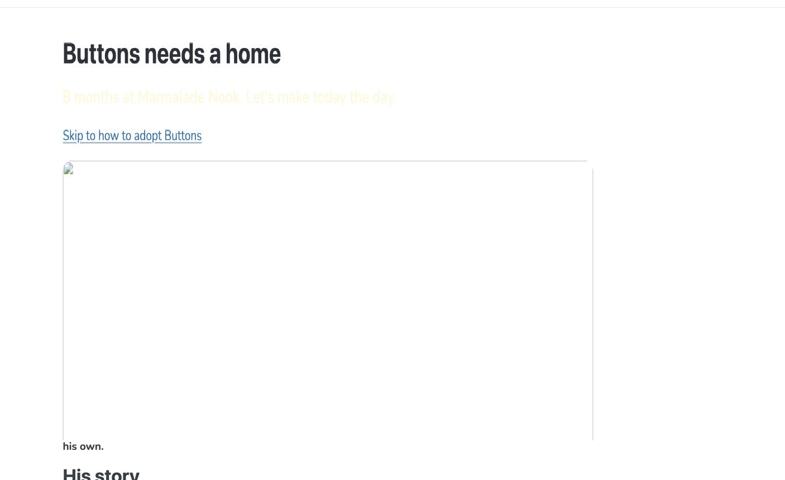
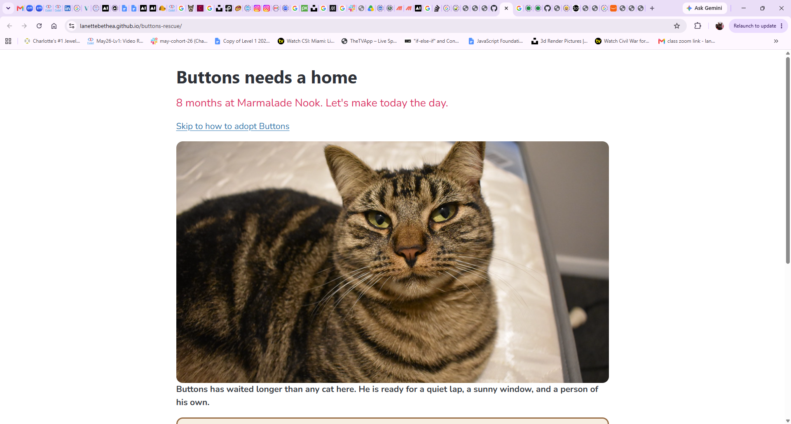

# Buttons' Rescue

The adoption page for Buttons, a long-stay cat at Marmalade Nook.
I inherited it broken, filed every problem as an issue, and fixed it
one commit at a time.

## Before and after

## What I fixed

- #1 - Fix cat pic - broken link
- #2 - Change tagline text color
- #3 - Fix id mismatch
- #4 - Close bold tab </b>
- #5 - Fix story class reference
- #6 - Fix URGENT style
- #7 - Darken the tagline text so that it reads against an off-white background
- #8 - Flesh out paragraph about Buttons

## Credits

Photo: "Cat" by Burnt Pineapple Productions, CC0 1.0.
Live page: https://lanettebethea.github.io/buttons-rescue/